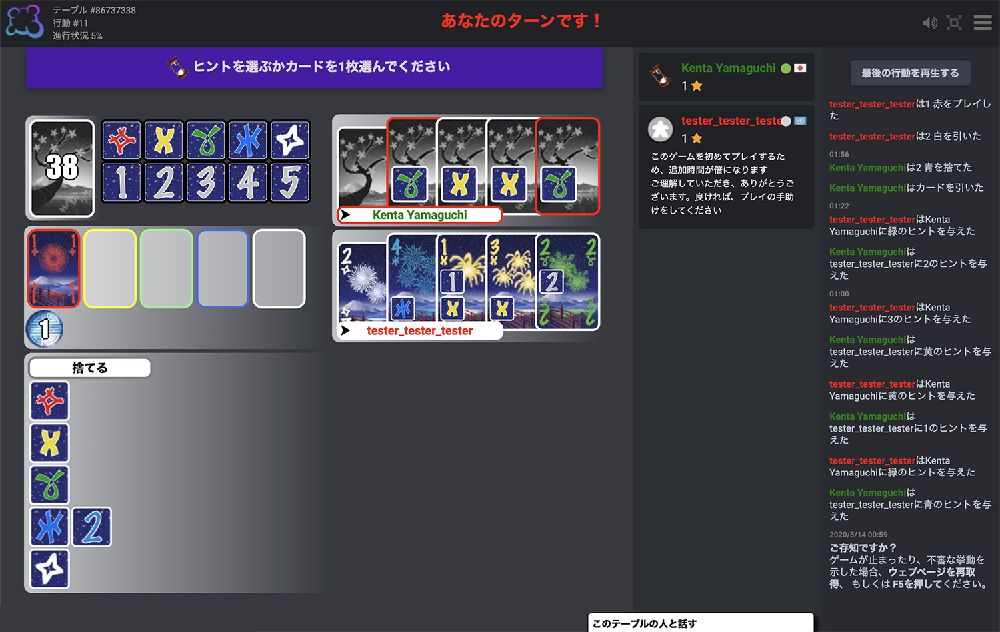

# Dark Theme for Board Game Arena

A customized dark theme for Board Game Arena.

## Preview

## Installation
1. Copy the style from here [dark-theme.css](https://github.com/bm-yamaguchi/bga-dark-theme/blob/master/dark-theme.css)
2. Paste the styles into the [BGA settings extension page](https://boardgamearena.com/preferences?section=advanced)

## Features
- Majority of game screen re-styled
